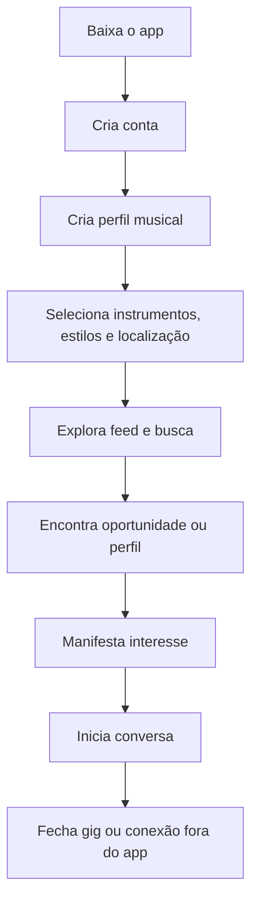
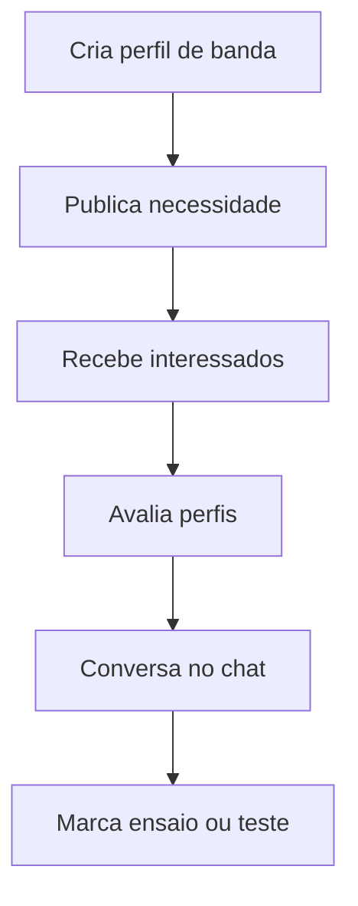
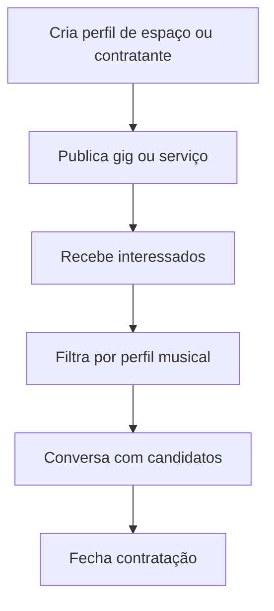

# WeGig - PRD, MVP Scope e Technical Architecture

**Data:** 17 de maio de 2026  
**Status:** documento de produto e arquitetura para alinhamento executivo, técnico e de escopo  
**Produto:** WeGig  
**Plataformas:** iOS e Android  
**Documento relacionado:** `MVP_Rev0.0.md`, `docs/project-info/MVP_DESCRIPTION.md`, `docs/guides/MVP_CHECKLIST.md`

## 1. Visão Geral do Produto

WeGig é uma rede social mobile para o ecossistema musical local. O produto conecta músicos, bandas, espaços musicais e contratantes por meio de perfis profissionais, feed social, busca por localização, publicação de oportunidades e conversa direta.

O aplicativo resolve a fragmentação atual do mercado musical independente: oportunidades aparecem em grupos de WhatsApp, perfis de Instagram, indicações informais e contatos dispersos. Esses canais funcionam para comunicação, mas não estruturam descoberta, reputação, filtros profissionais, localização, histórico de relacionamento e recorrência.

### Nome do projeto

WeGig.

### Problema que resolve

Músicos e contratantes têm dificuldade para se encontrar com velocidade, contexto e confiança. Bandas buscam integrantes, músicos buscam projetos, espaços divulgam serviços, contratantes precisam preencher oportunidades e a maior parte dessa dinâmica acontece em canais pouco organizados.

### Público-alvo

O MVP atende principalmente músicos, bandas e espaços musicais. Em ciclos posteriores, o produto expande a superfície para contratantes de eventos, produtores, igrejas, casas de show, estúdios e negócios musicais.

### Diferencial principal

O diferencial do WeGig é combinar rede social, perfil musical, geolocalização e oportunidades em um mesmo ambiente verticalizado para música. Em vez de adaptar Instagram, WhatsApp ou marketplaces genéricos, o usuário encontra pessoas, projetos e gigs usando critérios próprios do mercado musical.

### Objetivo do MVP

Validar se uma rede social verticalizada para música consegue gerar descoberta local, engajamento recorrente e conversas qualificadas entre perfis musicais. O MVP deve provar que usuários criam perfis, publicam necessidades reais, encontram pessoas próximas e iniciam contatos dentro do app.

### Declaração resumida

Aplicativo mobile de networking e oportunidades para músicos, bandas, espaços musicais e contratantes, focado em conexão rápida para gigs, projetos musicais, colaboração e descoberta local.

## 2. Problema de Mercado

O mercado musical local é altamente relacional, mas pouco estruturado digitalmente. A descoberta de oportunidades depende de grupos fechados, indicação pessoal, publicações efêmeras em redes sociais e contatos fragmentados.

Músicos têm dificuldade de:

- encontrar gigs compatíveis com instrumento, estilo, disponibilidade e região;
- montar ou completar bandas;
- encontrar substitutos para apresentações urgentes;
- divulgar trabalho com contexto profissional;
- manter networking local fora de grupos informais;
- encontrar estúdios, casas de show, luthiers, escolas e serviços próximos;
- separar identidade pessoal de identidade musical ou de projetos diferentes.

Contratantes e espaços musicais têm dificuldade de:

- encontrar músicos rapidamente por instrumento, estilo e cidade;
- avaliar disponibilidade e adequação mínima antes do contato;
- divulgar oportunidades para uma audiência musical qualificada;
- manter histórico de conversas e interesses;
- operar fora de planilhas, grupos e listas manuais.

Instagram e WhatsApp são canais importantes, mas não são estruturados para matching profissional musical. Eles não oferecem filtros por instrumento, gênero musical, localização, tipo de perfil, disponibilidade, tipo de gig ou relacionamento entre perfis.

## 3. Público-Alvo (ICP)

### Segmentos prioritários do MVP

| Segmento                | Necessidade principal                                | Valor esperado                              |
| ----------------------- | ---------------------------------------------------- | ------------------------------------------- |
| Músicos freelancers     | Encontrar gigs, bandas e contatos locais             | Mais oportunidades e networking qualificado |
| Bandas                  | Encontrar integrantes e divulgar projetos            | Recrutamento musical mais rápido            |
| Espaços musicais        | Divulgar serviços, vagas e oportunidades             | Visibilidade local para público musical     |
| Contratantes de eventos | Encontrar músicos e bandas para demandas específicas | Redução de tempo de busca                   |

### Segmentos adjacentes

- DJs;
- produtores musicais;
- casas de show;
- igrejas;
- estúdios;
- escolas de música;
- luthiers e lojas de instrumentos;
- produtores e organizadores de eventos.

### ICP inicial recomendado

O ICP inicial deve priorizar músicos e bandas em uma região urbana com densidade musical suficiente para efeito de rede local. A adoção inicial tende a ser maior em usuários que já participam de grupos de música, publicam conteúdo em redes sociais e buscam gigs ou colaborações com frequência.

### Perfil demográfico e comportamental

| Critério                  | Hipótese inicial                                                                 |
| ------------------------- | -------------------------------------------------------------------------------- |
| Idade média               | 18 a 45 anos                                                                     |
| Região inicial            | Uma cidade ou região metropolitana por ciclo beta                                |
| Nível profissional        | Amador avançado, semi-profissional e profissional independente                   |
| Comportamento digital     | Uso frequente de Instagram, WhatsApp, YouTube, TikTok e plataformas de streaming |
| Frequência de necessidade | Busca recorrente por contatos, projetos, serviços, ensaios, substituições e gigs |

## 4. Proposta de Valor

### Para músicos

- Conseguir gigs e oportunidades de colaboração.
- Criar um perfil musical com identidade própria.
- Encontrar músicos, bandas e espaços próximos.
- Divulgar trabalho com foto, bio, instrumentos, estilos e links.
- Receber mensagens e interesses de outros perfis musicais.
- Manter conexões profissionais separadas de redes pessoais.

### Para bandas

- Encontrar integrantes por instrumento, cidade e estilo.
- Publicar necessidades de formação ou contratação.
- Centralizar contatos com interessados.
- Manter presença pública do projeto.

### Para espaços musicais e negócios do setor

- Divulgar serviços, promoções, vagas, eventos e disponibilidade.
- Aparecer em buscas locais feitas por músicos.
- Receber contatos de perfis qualificados.
- Construir audiência dentro de uma comunidade musical verticalizada.

### Para contratantes

- Encontrar músicos rapidamente.
- Filtrar por instrumento, localidade e estilo.
- Publicar oportunidades com descrição, cidade, data e orçamento.
- Iniciar conversas com interessados sem depender de múltiplos canais externos.

## 5. Escopo do MVP

O MVP deve focar nas funções que validam networking, descoberta local, engajamento social e demanda real por oportunidades musicais. A recomendação é manter o núcleo inicial em cinco pilares:

1. Perfil musical.
2. Feed.
3. Busca e localização.
4. Publicação de gigs e oportunidades.
5. Chat.

### Entra no MVP

- Autenticação por email, Google e Apple.
- Criação e edição de perfil musical.
- Suporte a múltiplos perfis por conta, com perfis de músico, banda e espaço.
- Feed com posts simples, mídia e expiração.
- Publicações de oportunidade, contratação, busca de músico/banda e anúncios de espaço.
- Busca ou descoberta por localização, instrumento, gênero e tipo de perfil/post.
- Interesse em posts e início de conversa.
- Chat básico entre perfis.
- Notificações essenciais de interesse, mensagem e atividade relevante.
- Denúncia e bloqueio como camadas mínimas de segurança social.
- Analytics, crash reporting e métricas de funil.

### Não entra no MVP

- Marketplace transacional completo.
- Pagamentos, wallet, split, escrow ou repasse financeiro.
- Streaming de música nativo.
- IA avançada de matching.
- Videochamada.
- Lives.
- Monetização complexa.
- Assinaturas premium.
- Agenda integrada completa.
- Ranking público complexo.
- CRM para contratantes.
- Sistema de reputação com reviews públicos detalhados.

## 6. Funcionalidades do MVP (Core Features)

### V1 obrigatório

#### Cadastro e login

- Email e senha.
- Google Sign-In.
- Apple ID no iOS.
- Recuperação de senha.
- Sessão persistente.
- Fluxo obrigatório de criação de perfil após autenticação.

#### Perfil musical

- Foto.
- Nome artístico, nome da banda ou nome do espaço.
- Bio curta.
- Tipo de perfil: músico, banda ou espaço.
- Instrumentos.
- Estilos musicais.
- Cidade e localização.
- Links externos, como Instagram, YouTube, Spotify, SoundCloud ou portfólio.
- Troca de perfil quando a conta possuir múltiplos perfis.

#### Feed social

- Lista de posts recentes e válidos.
- Posts com texto e mídia.
- Tipos de post para músico, banda, contratação e anúncio.
- Curtidas ou interesse, conforme o tipo de post.
- Comentários quando disponíveis no ciclo atual.
- Detalhe do post.
- Expiração automática para reduzir conteúdo obsoleto.

#### Busca e localização

- Filtros por cidade ou raio.
- Filtros por instrumento.
- Filtros por gênero musical.
- Filtros por tipo de perfil ou tipo de post.
- Visualização em lista e/ou mapa, conforme disponibilidade do app.

#### Match, interesse e gig

- Criar oportunidade de contratação.
- Informar descrição, cidade, data, orçamento ou cachê quando aplicável.
- Candidatar-se ou manifestar interesse.
- Ver interessados no próprio post.
- Iniciar conversa a partir de interesse ou perfil.

#### Chat

- Mensagens privadas entre perfis.
- Lista de conversas.
- Mensagens em tempo real.
- Notificação push de nova mensagem.
- Bloqueio impedindo continuidade de contato indesejado.

#### Notificações push

- Interesse em publicação.
- Nova mensagem.
- Oportunidades próximas ou relevantes.
- Convites e eventos sociais essenciais de rede.

### V1.1

- Sugestões de conexão por proximidade e afinidade musical.
- Minha Rede como hub social de conexões, convites e atividade.
- Melhorias de filtros, ordenação e paginação em listas.
- Moderação operacional via painel administrativo.
- Preferências de privacidade por perfil.
- Métricas mais detalhadas de funil de oportunidade.

### Futuro

- Monetização premium.
- Destaque de gigs e perfis patrocinados.
- Matching assistido por IA.
- Reputação, avaliações e histórico de contratação.
- Agenda e disponibilidade.
- Pagamentos e contratos.
- Integrações com calendários e plataformas externas.
- Ferramentas avançadas para casas de show, igrejas, produtoras e contratantes recorrentes.

## 7. Funcionalidades Fora do MVP

Estas funcionalidades devem permanecer fora do MVP para evitar aumento excessivo de prazo, custo e risco técnico:

- marketplace completo;
- streaming de áudio ou vídeo;
- IA de matching avançado;
- videochamada;
- lives;
- monetização complexa;
- assinaturas premium;
- agenda integrada completa;
- wallet, pagamentos, split e escrow;
- contratação com assinatura digital;
- curadoria editorial ampla;
- sistema completo de anúncios self-service;
- ranking público com gamificação;
- ferramentas de produção musical;
- distribuição musical;
- upload de arquivos de áudio pesados como produto principal;
- CRM completo para contratantes.

## 8. Jornada do Usuário (User Flow)

### Fluxo principal do músico



### Fluxo principal da banda



### Fluxo principal do contratante ou espaço



## 9. Wireframes / Telas

O MVP não exige design final para validação documental, mas deve ter wireframes low fidelity ou protótipos simples para as telas principais.

### Telas obrigatórias

| Tela            | Objetivo                                                       |
| --------------- | -------------------------------------------------------------- |
| Splash          | Inicialização, validação de sessão e ambiente                  |
| Login/Cadastro  | Entrada do usuário no produto                                  |
| Criar perfil    | Capturar identidade musical mínima                             |
| Home/feed       | Expor publicações e oportunidades recentes                     |
| Perfil          | Exibir identidade, instrumentos, estilos, links e posts        |
| Busca/Mapa      | Descobrir perfis e posts por localização e filtros             |
| Publicar        | Criar post, oportunidade, contratação ou anúncio               |
| Detalhe do post | Concentrar informação e ações de interesse                     |
| Chat            | Permitir conversa direta entre perfis                          |
| Notificações    | Mostrar eventos relevantes e reengajar o usuário               |
| Minha Rede      | Reunir conexões, convites e atividade social quando habilitado |
| Configurações   | Preferências, privacidade, bloqueios e conta                   |

### Artefatos recomendados

- Protótipo Figma ou wireframes low fidelity.
- Mapa de navegação do app.
- Fluxo de criação de perfil.
- Fluxo de publicação de gig.
- Fluxo de interesse e chat.
- Estados vazios, loading, erro e permissão negada.

## 10. Arquitetura Técnica (Alto Nível)

### Mobile

O app é desenvolvido em Flutter para iOS e Android, com monorepo Melos e separação entre app principal e biblioteca compartilhada de UI/domínio.

| Item             | Decisão                        |
| ---------------- | ------------------------------ |
| Framework mobile | Flutter                        |
| Linguagem        | Dart                           |
| Plataformas      | iOS e Android                  |
| State management | Riverpod com codegen           |
| Navegação        | GoRouter com extensões tipadas |
| Design system    | `packages/core_ui`             |

### Backend

| Item                | Decisão                                                               |
| ------------------- | --------------------------------------------------------------------- |
| Autenticação        | Firebase Auth                                                         |
| Banco principal     | Cloud Firestore                                                       |
| Storage de mídia    | Firebase Storage                                                      |
| Funções server-side | Cloud Functions Node.js 20                                            |
| Push notifications  | Firebase Cloud Messaging                                              |
| Crash reporting     | Firebase Crashlytics                                                  |
| Analytics           | Firebase Analytics, com possibilidade futura de Mixpanel ou Amplitude |

### Infraestrutura e ambientes

- Ambientes separados para desenvolvimento, staging e produção.
- Validação de projeto Firebase no bootstrap para evitar cruzamento de dados.
- Regras de segurança no Firestore.
- Índices compostos versionados.
- Cloud Functions na região `southamerica-east1`.
- Cache local e configuração de persistência do Firestore por flavor.

### Arquitetura de software

O app segue Clean Architecture por feature:

```text
packages/app/lib/features/<feature>/
  data/
    datasources/
    models/
    repositories/
  domain/
    entities/
    repositories/
    usecases/
  presentation/
    pages/
    providers/
    widgets/
```

As dependências fluem da apresentação para o domínio e depois para a camada de dados. Providers Riverpod fazem a injeção de dependência e notifiers orquestram estados de UI.

## 11. Estrutura de Dados

### User

```json
{
  "id": "firebase-auth-uid",
  "email": "user@example.com",
  "activeProfileId": "profile-id",
  "createdAt": "timestamp",
  "updatedAt": "timestamp"
}
```

### Profile

```json
{
  "id": "profile-id",
  "uid": "firebase-auth-uid",
  "name": "João Silva",
  "username": "joaoguitar",
  "profileType": "musician",
  "photoUrl": "https://...",
  "bio": "Guitarrista de rock e blues",
  "instruments": ["guitarra"],
  "genres": ["rock", "blues"],
  "location": "GeoPoint",
  "city": "São Paulo",
  "links": ["https://instagram.com/..."],
  "allowConnectionSuggestions": true,
  "allowConnectionRequests": true,
  "createdAt": "timestamp",
  "updatedAt": "timestamp"
}
```

### Post

```json
{
  "id": "post-id",
  "authorProfileId": "profile-id",
  "type": "hiring",
  "title": "Procuro baixista para show",
  "description": "Show em bar no sábado",
  "mediaUrls": ["https://..."],
  "instruments": ["baixo"],
  "genres": ["rock"],
  "city": "São Paulo",
  "location": "GeoPoint",
  "budget": 500,
  "eventDate": "timestamp",
  "expiresAt": "timestamp",
  "createdAt": "timestamp",
  "updatedAt": "timestamp"
}
```

### Interest

```json
{
  "id": "interest-id",
  "postId": "post-id",
  "postAuthorProfileId": "profile-id",
  "interestedProfileId": "profile-id",
  "status": "pending",
  "createdAt": "timestamp"
}
```

### Conversation

```json
{
  "id": "conversation-id",
  "participantProfileIds": ["profile-a", "profile-b"],
  "lastMessage": "Olá, tenho interesse na gig",
  "lastMessageAt": "timestamp",
  "createdAt": "timestamp",
  "updatedAt": "timestamp"
}
```

### Message

```json
{
  "id": "message-id",
  "conversationId": "conversation-id",
  "senderProfileId": "profile-id",
  "text": "Ainda está disponível?",
  "createdAt": "timestamp",
  "readBy": ["profile-id"]
}
```

### Report

```json
{
  "id": "report-id",
  "reporterProfileId": "profile-id",
  "targetType": "post",
  "targetId": "post-id",
  "reason": "spam",
  "description": "Conteúdo repetitivo",
  "status": "open",
  "createdAt": "timestamp"
}
```

## 12. Regras de Negócio

- Uma conta pode ter múltiplos perfis, com limite operacional definido pelo produto.
- Cada perfil possui identidade e contexto próprios.
- Um músico pode ter múltiplos instrumentos.
- Um perfil pode publicar posts de acordo com permissões e tipo de perfil.
- Posts devem ter expiração para reduzir oportunidades obsoletas.
- Posts de contratação devem informar dados mínimos da oportunidade, como descrição e localidade.
- Chat deve respeitar bloqueios entre perfis.
- Denúncias devem ser registradas com alvo, motivo e autor.
- Conteúdo de usuário deve passar por filtro de conteúdo ofensivo antes de escrita quando aplicável.
- Upload de mídia deve respeitar limites de tamanho, quantidade e compressão.
- Busca por posts ativos deve filtrar `expiresAt` e ordenar por expiração conforme índices do Firestore.
- Profile switching deve invalidar caches de feed, interesse e contexto social.
- Preferências de privacidade e conexão são escopadas ao perfil, não apenas à conta.
- FCM tokens permanecem vinculados à conta/dispositivo, mesmo com troca de perfil.

## 13. Estratégia de Monetização

A monetização não deve bloquear a validação do MVP. A primeira fase deve priorizar densidade de rede, recorrência e volume de oportunidades.

### Possibilidades futuras

| Modelo               | Descrição                                           | Momento recomendado                     |
| -------------------- | --------------------------------------------------- | --------------------------------------- |
| Assinatura premium   | Recursos avançados para músicos, bandas e espaços   | Após validação de retenção              |
| Destaque de gigs     | Oportunidades promovidas no feed/busca              | Após volume consistente de posts        |
| Perfil patrocinado   | Maior visibilidade para espaços, bandas ou serviços | Após tráfego local relevante            |
| Anúncios segmentados | Publicidade musical contextual                      | Após base ativa mensurável              |
| Taxa por contratação | Comissão ou fee sobre gigs fechadas                 | Apenas após fluxo transacional maduro   |
| Ferramentas B2B      | Planos para casas, igrejas, estúdios e produtoras   | Após demanda recorrente de contratantes |

## 14. KPIs do MVP

### Aquisição

- Downloads por canal.
- Custo de aquisição por usuário, quando houver mídia paga.
- Taxa de cadastro concluído.
- Taxa de criação de perfil após cadastro.

### Ativação

- Percentual de usuários com perfil completo.
- Tempo até primeira publicação.
- Tempo até primeira busca.
- Tempo até primeiro interesse ou mensagem.

### Engajamento

- Usuários ativos diários e mensais.
- Retenção D1, D7 e D30.
- Posts criados por semana.
- Gigs publicadas por mês.
- Interesses realizados.
- Mensagens enviadas.
- Conversas iniciadas.
- Conexões ou relações sociais criadas, quando habilitado.

### Qualidade de marketplace/rede

- Taxa de posts com ao menos um interessado.
- Taxa de interesses que viram conversa.
- Taxa de conversas com resposta.
- Tempo médio até primeiro contato.
- Distribuição geográfica de usuários ativos.
- Densidade de perfis por cidade.

### Segurança e saúde da comunidade

- Denúncias por mil usuários ativos.
- Tempo médio de resposta a denúncia.
- Bloqueios por mil conversas.
- Conteúdos removidos por violação.

## 15. Roadmap

### Fase 0 - Preparação

- Consolidar PRD, escopo e critérios de sucesso.
- Definir cidade ou região beta.
- Revisar regras de segurança, analytics e moderação.
- Preparar onboarding e comunicação de beta.

### Fase 1 - MVP

- Perfil musical.
- Feed.
- Busca/localização.
- Publicação de gigs e oportunidades.
- Interesse e chat.
- Notificações essenciais.
- Denúncia, bloqueio e privacidade mínima.

### Fase 2 - Beta fechado

- Lançamento controlado em uma cidade ou comunidade musical.
- Convites para músicos, bandas e espaços parceiros.
- Monitoramento de funil e retenção.
- Ajustes de UX e filtros.
- Validação qualitativa com entrevistas.

### Fase 3 - V1.1

- Minha Rede e recomendações sociais.
- Melhorias de descoberta e paginação.
- Painel de moderação mais completo.
- Notificações mais contextuais.
- Preparação para primeiras experiências de monetização leve.

### Fase 4 - V2

- Monetização.
- Matching avançado.
- Ferramentas para contratantes recorrentes.
- Reputação e avaliações.
- Agenda e disponibilidade.
- Expansão para múltiplas cidades.

## 16. Segurança e Compliance

WeGig é uma rede social com conteúdo gerado por usuários, mensagens privadas e dados de localização. Segurança, privacidade e moderação devem estar presentes desde o MVP.

### LGPD e privacidade

- Coletar apenas dados necessários para a experiência principal.
- Informar finalidade de uso de localização, notificações e perfil público.
- Permitir atualização e exclusão de dados conforme política do produto.
- Manter termos de uso e política de privacidade disponíveis.
- Separar dados de conta e dados de perfil quando possível.

### Moderação

- Denúncia de usuários, posts e mensagens quando aplicável.
- Bloqueio entre perfis.
- Filtro de conteúdo ofensivo no cliente e backstop server-side.
- Painel operacional para revisão de denúncias.
- Regras claras para remoção de conteúdo.

### Segurança técnica

- Firebase Auth para identidade.
- Regras de Firestore e Storage por ownership e permissões.
- Cloud Functions para rotinas sensíveis e notificações.
- App Check como camada adicional de proteção contra abuso de backend.
- Crashlytics e logs controlados por ambiente.
- Evitar exposição de segredos no app e no repositório.

## 17. Requisitos Não Funcionais

| Categoria        | Requisito                                                                               |
| ---------------- | --------------------------------------------------------------------------------------- |
| Performance      | Telas principais devem carregar rapidamente em redes móveis comuns                      |
| Escalabilidade   | Queries devem usar índices e paginação para listas de feed, busca, mensagens e conexões |
| Disponibilidade  | Backend deve depender de serviços gerenciados com alta disponibilidade                  |
| Resiliência      | App deve lidar com estados offline, timeouts e falhas parciais                          |
| Observabilidade  | Erros críticos devem ir para Crashlytics e eventos-chave para Analytics                 |
| Segurança        | Acesso a dados deve ser validado por regras e ownership                                 |
| Privacidade      | Localização e perfil público devem ter comunicação clara ao usuário                     |
| Manutenibilidade | Features devem seguir Clean Architecture e DI por providers                             |
| Testabilidade    | Regras de domínio devem ser testáveis sem Firebase real                                 |
| Acessibilidade   | Interface deve respeitar contraste, tamanhos de toque e estados compreensíveis          |

## 18. Stack de Analytics

### Dia 1

- Firebase Analytics para eventos de funil e comportamento.
- Firebase Crashlytics para falhas.
- Logs controlados por ambiente.
- Eventos de navegação e autenticação.
- Eventos de criação de perfil, post, interesse, chat e notificação.

### Eventos mínimos recomendados

- `sign_up_started`
- `sign_up_completed`
- `profile_created`
- `profile_completed`
- `post_created`
- `post_viewed`
- `interest_sent`
- `conversation_started`
- `message_sent`
- `search_performed`
- `filter_applied`
- `notification_opened`
- `report_submitted`
- `profile_switched`

### Futuro

- Mixpanel ou Amplitude para análise de cohorts e funis avançados.
- BigQuery para análises de marketplace/rede.
- Dashboards por cidade, segmento e fonte de aquisição.

## 19. Critérios de Sucesso do MVP

O MVP será considerado validado se demonstrar que há uso recorrente e criação real de oportunidades entre perfis musicais.

### Critérios quantitativos sugeridos para 6 meses

- 5.000 usuários ativos mensais em uma ou poucas regiões de foco.
- 500 gigs ou oportunidades publicadas por mês.
- 30% ou mais dos novos usuários criando perfil completo.
- 25% ou mais dos posts recebendo ao menos um interesse.
- 40% ou mais dos interesses gerando conversa.
- Retenção D7 suficiente para indicar recorrência semanal de descoberta.
- Tempo médio até primeira ação de valor inferior a 10 minutos após criação de perfil.

### Critérios qualitativos

- Músicos relatam descoberta de pessoas ou oportunidades que não encontrariam facilmente em outros canais.
- Bandas conseguem receber candidatos relevantes.
- Contratantes e espaços conseguem publicar e receber contatos com menos atrito que WhatsApp/Instagram.
- Usuários entendem claramente por que manter o app instalado.

## 20. Estimativa de Desenvolvimento

As estimativas abaixo consideram um time enxuto e um produto já orientado por Flutter/Firebase. Devem ser recalibradas conforme estado real do backlog, dívida técnica, qualidade dos designs e necessidade de refatoração.

### Equipe mínima recomendada

| Papel                      | Alocação sugerida |
| -------------------------- | ----------------- |
| Product Manager / Founder  | 0.5 a 1.0 FTE     |
| Flutter developer          | 1 a 2 FTE         |
| Backend/Firebase developer | 0.5 a 1 FTE       |
| Product designer           | 0.5 FTE           |
| QA                         | 0.25 a 0.5 FTE    |
| Growth/Community           | 0.5 FTE no beta   |

### Fases e esforço

| Fase                              | Duração sugerida | Entregas                                                         |
| --------------------------------- | ---------------- | ---------------------------------------------------------------- |
| Descoberta e fechamento de escopo | 1 a 2 semanas    | PRD final, métricas, fluxos e wireframes                         |
| Design e arquitetura detalhada    | 2 a 3 semanas    | Protótipo navegável, modelo de dados, eventos analytics          |
| Implementação MVP                 | 8 a 12 semanas   | Perfil, feed, busca, gigs, chat, notificações e moderação mínima |
| QA e hardening                    | 2 a 4 semanas    | Testes, correções, performance, regras e crash-free baseline     |
| Beta fechado                      | 4 a 8 semanas    | Comunidade inicial, métricas, entrevistas e iteração             |

### Faixa de horas

| Área                          | Estimativa      |
| ----------------------------- | --------------- |
| Produto e especificação       | 40 a 80 horas   |
| UX/UI                         | 80 a 160 horas  |
| Flutter                       | 400 a 800 horas |
| Firebase/Cloud Functions      | 120 a 240 horas |
| QA e testes                   | 120 a 240 horas |
| Analytics, release e operação | 60 a 120 horas  |

### Observação de custo

O custo final varia conforme senioridade, país, profundidade do design, qualidade esperada do beta e quanto da base atual será reaproveitada. Para controle de risco, o MVP não deve incorporar pagamentos, IA avançada, streaming ou marketplace transacional antes de validar densidade de rede e recorrência.

## Decisão de Produto Recomendada

O MVP inicial do WeGig deve focar somente em:

1. Perfil musical.
2. Feed.
3. Busca/localização.
4. Publicação de gigs.
5. Chat.

Esse recorte valida os pilares essenciais do negócio: networking, engajamento, efeito de rede local e demanda real por oportunidades musicais. O restante deve ser tratado como expansão após evidência de uso recorrente e conversas qualificadas dentro do app.
